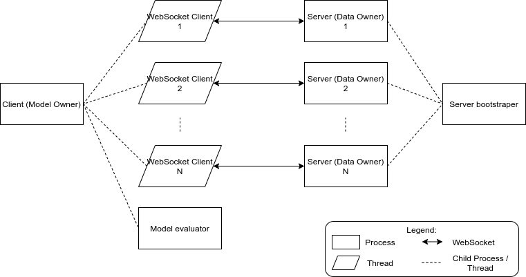

# Async FL using PySyft
My bachelor thesis project, to fulfill a degree requirement from Bandung Institute of Technology

by Senapati S. Diwangkara, 2020

## How to Run
3 years after completing this project, I got messages from non-negligible amount of people interested in replicating and understanding this project. 
As such, I'm updating this README to include additional instruction to run the experiment in the paper.

This project was originally written in Python 3.7 and installing the `requirements.txt` using the contemporary version of Python would probably give you some version error.
Therefore, I'm adding a conda `environment.yml` with Python 3.7 and some additional MKL packages (`sip`, `mkl_fft`, and `mkl_random`) with the appropriate version so that you could install from `requirements.txt` without conflict.

1. Install Conda and set it up with the `conda-forge` channel
2. Create an environment from the environment file: `conda env create --file environment.yml`
3. Activate the environment: `conda activate asyncfl`
4. Install the pip packages: `pip install -r requirements.txt`
5. Run the experiment: `./train_batch.sh`

## Paper
This [paper](paper.pdf) was published on [ICITSI 2020](https://ieeexplore.ieee.org/document/9264958)

This work examines the effect of asynchronicity in aggregation algorithm (i.e. when the nodes' training round / epoch don't have to be in sync with one another). 
In particular, I'm interested in the effect of data imbalance. 
Intuitively speaking, if we have some true/false dataset that is split between 2 nodes, but each node only have either true or false data, and one node is faster than the other, than the trained model should perform worse than if the model is trained centrally, right?
So here, we tried to verify that intuition quntitatively.

## Experiment Architecture

Clients are implemented in `src/client.py`. 
It will spool up some client threads to connect to each server, and an evaluator process to evaluate the latest model periodically. 
Each client threads will communicate with the evaluator process with the `evaluator_q` variable, that acts as a queue. 
The threads will enqueue their evaluation order and they will be consumed by the evaluator process, which then will evaluate the snapshoted model and print the result.

Servers are implemented in `src/servers.py`. 
It will split a given dataset (using `src/split_dataset.py`) and started the servers that will host said data.

To measure optimization performance, we use `yappi` as a profiler to measure how much time each function is spending.

## Questions?
You could send me an [email](https://www.cs.jhu.edu/~diwangs/) or DM me on [Twitter](https://twitter.com/diwangs_)!